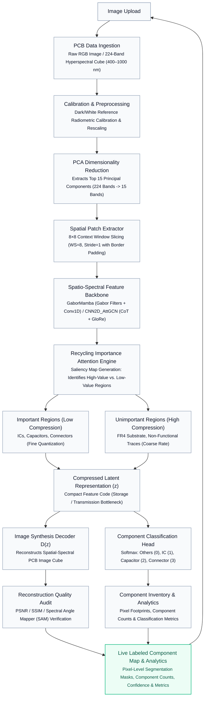

# PCB HyperSpectral Vision & Recycling-Aware Deep Compression Flow Diagram

## End-to-End System Flowchart

---

## Generated Artifacts

* 🖼️ **High-Resolution Vector Diagram**: [pcb_project_flow_diagram.png](file:///c:/Users/sanub/OneDrive/Desktop/Major/pcb_project_flow_diagram.png)
* 📄 **Clean 1-Page PDF**: [PCB_Recycling_Flow_Architecture.pdf](file:///c:/Users/sanub/OneDrive/Desktop/Major/PCB_Recycling_Flow_Architecture.pdf)
